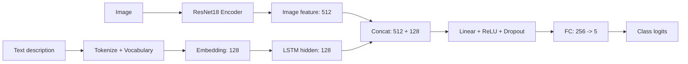

# Food_Multimodal

一个面向深度学习课程设计的五分类食物识别项目。项目同时实现并对比了两条路线：

- **Image-only**：仅使用食物图片，通过 ResNet18 完成分类。
- **Multimodal**：同时使用图片和英文文本描述，融合视觉特征与文本特征后完成分类。

当前实验结果显示，多模态模型在测试集上的准确率达到 **92.22%**，相比仅图像模型的 **90.00%** 有一定提升，说明文本描述可以为图像分类提供补充信息。

## 项目任务

输入数据由食物图片、类别标签和英文文本描述组成，目标是将样本分类到以下 5 个类别之一：

| 类别 | 含义 |
| --- | --- |
| `baozi` | 包子 |
| `cupcake` | 纸杯蛋糕 |
| `french_fries` | 薯条 |
| `rice` | 米饭 |
| `youtiao` | 油条 |

## 数据集

数据集已经划分为训练集、验证集和测试集，每个 split 都包含图片目录和 `metadata.csv` 标注文件。

```text
data/
  train/
    images/
    metadata.csv
  val/
    images/
    metadata.csv
  test/
    images/
    metadata.csv
```

`metadata.csv` 包含三列：

```text
image_path,label,text
```

| Split | 样本数 | 每类样本数 |
| --- | ---: | --- |
| Train | 305 | 每类 61 |
| Val | 45 | 每类 9 |
| Test | 90 | 每类 18 |

## 模型结构

### 仅图像分类模型

Image-only 模型使用 ImageNet 预训练的 ResNet18，并将最后的全连接层替换为 5 分类输出层。


### 图像 + 文本多模态模型

Multimodal 模型由图像分支、文本分支和融合分类器组成：

- 图像分支：ResNet18 去掉最后分类层，输出 512 维视觉特征。
- 文本分支：英文文本经过分词、词表映射、Embedding 和 LSTM，输出 128 维文本特征。
- 融合分支：拼接视觉特征和文本特征，经 MLP 输出 5 类 logits。



## 实验设置

| 配置项 | 值 |
| --- | --- |
| 图像尺寸 | 224 x 224 |
| Backbone | ResNet18 |
| 预训练权重 | ImageNet |
| Batch size | 32 |
| Epochs | 10 |
| Optimizer | Adam |
| Learning rate | 1e-3 |
| Loss | CrossEntropyLoss |
| 随机种子 | 42 |
| 文本最大长度 | 40 |
| 多模态词表大小 | 701 |

## 实验结果

### 测试集整体结果

| 模型 | 输入 | Test Loss | Test Acc | Macro F1 | Weighted F1 |
| --- | --- | ---: | ---: | ---: | ---: |
| ImageOnlyModel | 图像 | 0.7011 | 90.00% | 90.02% | 90.02% |
| MultimodalModel | 图像 + 文本 | **0.2225** | **92.22%** | **91.94%** | **91.94%** |

### 各类别 F1-score

| 类别 | Image-only F1 | Multimodal F1 |
| --- | ---: | ---: |
| `baozi` | 94.44% | **97.30%** |
| `cupcake` | **81.08%** | 78.79% |
| `french_fries` | 85.71% | **94.44%** |
| `rice` | 94.12% | **97.30%** |
| `youtiao` | **94.74%** | 91.89% |

从结果看，多模态模型在 `baozi`、`french_fries` 和 `rice` 上提升明显；`cupcake` 与 `youtiao` 的 F1 略低于仅图像模型，说明文本特征整体有帮助，但在部分类别上仍可能受到描述质量或样本差异影响。

## 训练曲线

### Loss 曲线

| Image-only | Multimodal |
| --- | --- |
|  |  |

### Accuracy 曲线

| Image-only | Multimodal |
| --- | --- |
|  |  |

## 项目结构

```text
Food_Multimodal/
  data/                         # train/val/test 数据集
  outputs/
    checkpoints/                # 最优模型权重
      image_only_best.pth
      multimodal_best.pth
    figures/                    # loss / acc 曲线图
    logs/                       # 训练日志和测试指标
  src/
    check_data.py               # 数据完整性检查与类别统计
    config.py                   # 路径、类别、训练超参数等统一配置
    dataset.py                  # PyTorch Dataset、图像预处理、文本编码
    text_utils.py               # 分词、词表构建、padding
    models.py                   # ImageOnlyModel 与 MultimodalModel
    train_image.py              # 仅图像模型训练
    train_multimodal.py         # 多模态模型训练
    evaluate_image.py           # 仅图像模型测试集评估
    evaluate_multimodal.py      # 多模态模型测试集评估
    plot_curves.py              # 根据 CSV 日志绘制曲线
    test_dataset.py             # 数据集模块测试
    test_image_model.py         # 图像模型前向测试
    test_multimodal_model.py    # 多模态模型前向测试
  requirements.txt
  README.md
```

## 运行方式

安装依赖：

```bash
pip install -r requirements.txt
```

检查数据：

```bash
python src/check_data.py
```

训练仅图像模型：

```bash
python src/train_image.py
```

训练多模态模型：

```bash
python src/train_multimodal.py
```

评估模型：

```bash
python src/evaluate_image.py
python src/evaluate_multimodal.py
```

绘制训练曲线：

```bash
python src/plot_curves.py
```

## 输出文件

| 文件 | 说明 |
| --- | --- |
| `outputs/checkpoints/image_only_best.pth` | 验证集表现最好的仅图像模型权重 |
| `outputs/checkpoints/multimodal_best.pth` | 验证集表现最好的多模态模型权重，包含训练集词表 |
| `outputs/logs/image_train_log.csv` | 仅图像模型训练与验证日志 |
| `outputs/logs/multimodal_train_log.csv` | 多模态模型训练与验证日志 |
| `outputs/logs/image_test_metrics.txt` | 仅图像模型测试集评估结果 |
| `outputs/logs/multimodal_test_metrics.txt` | 多模态模型测试集评估结果 |
| `outputs/figures/*_curve.png` | loss 和 accuracy 曲线图 |

## 小结

本项目完成了从数据读取、图像预处理、文本编码、模型训练、测试集评估到结果可视化的完整流程。实验对比表明，在该五类食物分类任务中，融合英文文本描述后的多模态模型取得了更低的测试损失和更高的测试准确率，整体表现优于仅图像输入的基线模型。
